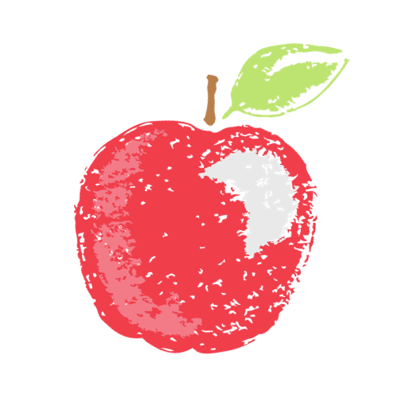
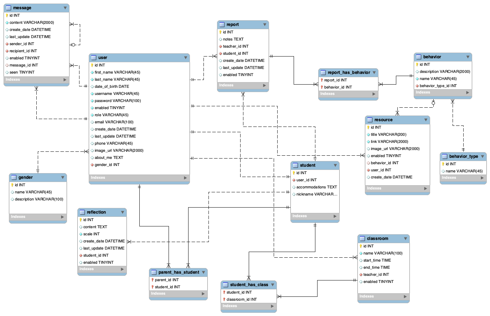

# FinalProject

## Overview

We wanted to create a site that allowed school teachers, students, and parents
to all come together for the healthy development of the school children. We
achieved this by:
* allowing teachers to log student behaviors and make student reports
* providing data visualization tools for teachers to understand these behaviors over time
* allow students to log reflections of their school experience
* allow parents to see the teacher reports
* allow teachers and parents to be in contact through the site, to address
any celebrations and challenges that arise for the students

## Site Mission Statement
Good Apples stresses the importance of character education by providing teachers with a tool to record and recognize patterns in commonly displayed traits in students. It is meant to show that, in teaching, concerns for the intellectual and the moral are ultimately inseparable. Teachers are connected with Resources to aid in implementing lessons in the classroom to help students practice behaviors that reflect universal ethical values.

## Team Members
* Maggie Elizabeth Barton
* Cody Sherwood Comstock
* Sawyer Harnedy
* Casey Kahn

## Database

## API 
| HTTP Verb | URI                          | Request Body                | Response Body             | Status           |
|-----------|------------------------------|-----------------------------|---------------------------|------------------|
| POST      | `api/register`               | JSON of new user            | JSON of created user      | 201 or 400       |
| GET		| `authenticate`               |auth username password       | JSON of logged in user    | 200 or 401       |
| GET		| `api/classes`                |                             | List of classrooms        | 200              |
| GET		| `api/classes/1`              |                             | Single classroom          | 200 or 404       |
| POST		| `api/classes`                | JSON of new classroom       | JSON of created classroom | 200 or 404       |
| PUT       | `api/classes/1`              | JSON for updating classroom | JSON of updated classroom | 200, 404, or 400 |
| DELETE    | `/api/classes/1`             |                             | 204, 404, or 400          |                  |
| POST		| `api/classes/1/students/1`   | JSON of new classroom       | JSON of created classroom | 200 or 404       |
| DELETE    | `/api/classes/1/students/1   |                             | 204, 404, or 400          |                  |
| GET		| `api/messages`               |                             | List of classrooms        | 200              |
| GET		| `api/messages/1/replies`     |                             | List of reply messages    | 200 or 404       |
| GET		| `api/messages/unread`        |                             | List of unread messages   | 200 or 404       |
| POST		| `api/messages/1`             | JSON of new classroom       | JSON of created classroom | 200 or 404       |
| PUT       | `api/messages`               | JSON for updating message   | JSON of updated message   | 200, 404, or 400 | 
| PUT       | `api/messages/thread`        | JSON for updating thread    | JSON of updated thread    | 200, 404, or 400 |
| GET		| `api/reflections/students/1` |                             | List of reflections       | 200 or 404       |
| POST		| `api/reflections`            | JSON of new reflection      | JSON of created reflection| 200 or 404       |
| DELETE    | `/api/reflections/1`         |                             | 204, 404, or 400          |                  |
| GET		| `api/behaviors`              |                             | List of behaviors         | 200              |
| GET		| `api/reports/1`              |                             | Single report             | 200 or 404       |
| GET		| `api/reports/students/1`     |                             | List of reports           | 200 or 404       |
| PUT       | `api/reports/1`              | JSON for updating message   | JSON of updated message   | 200, 404, or 400 |
| POST		| `api/reports/students/1`     | JSON of new report          | JSON of created report    | 200 or 404       |
| POST		| `api/reports/1/behaviors/1`  |                             | JSON of updating report   | 200 or 404       |
| DELETE    | `/api/reports/1/behaviors/1` |                             | 204, 404, or 400          |                  |
| DELETE    | `/api/reports/1`             |                             | 204, 404, or 400          |                  |
| GET		| `api/resources`              |                             | List of behaviors         | 200              |
| GET		| `api/classes/1/students`     |                             | List of studetns          | 200 or 404       |
| GET		| `api/classes/1/students/1`   |                             | Single report             | 200 or 404       |
| POST		| `api/register/students/1`    |                             | JSON of updating report   | 200 or 404       |
| GET		| `api/students`               |                             | List of students          | 200              |
| PUT       | `api/users`                  | JSON for updating user      | JSON of updated user      | 200, 404, or 400 |
| PUT       | `api/users/10/students/1`    | JSON for updating user      | JSON of updated user      | 200, 404, or 400 |
| DELETE    | `/api/users/1`               |                             | 204, 404, or 400          |                  |
| DELETE    | `/api/users`                 |                             | 204, 404, or 400          |                  |
| GET		| `api/users/students`         |                             | Single studetn            | 200 or 404       |
| GET		| `api/users/kids`             |                             | List of studetns          | 200 or 404       |
| GET		| `api/users/teachers`         |                             | List of users             | 200 or 404       |
| GET		| `api/users/parents`          |                             | List of users             | 200 or 404       |

## Technologies Used
* Java
* Angular
* Javascript
* Spring Boot
* Spring Tool Suite
* Canva
* Stack Overflow
* ngBootstrap
* Angular
* Visual Studio Code
* Bootstrap
* Gradle
* Trello
* Git
* Highcharts
* Github
* Postman
* MySQL

## Lessons Learned

This project was our most ambitious of our Skill Distillery Bootcamp experience.
We gained hands-on technical experience in all levels of the stack. 
We also learned valuable teamwork skills as we came together to make this
project a reality. 

